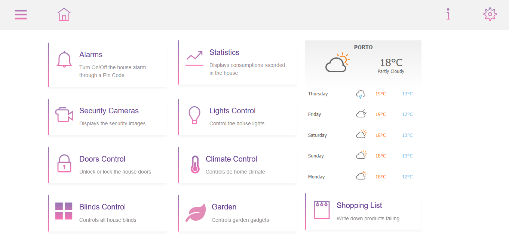

<h1 align="center"> Domotic Dashboard Application</h1>  

Dashboard application developed to control, manage and configure some aspects/tecnologies of our home. The aim of this project was to implement an application that was intuitive and easy to use for various types of users.

    

## Technologies
- Html & CSS
- Javascript
- Google Charts

## Demo

Available: https://cmalbuquerque.github.io/domotic-dashboard/

## Authors

